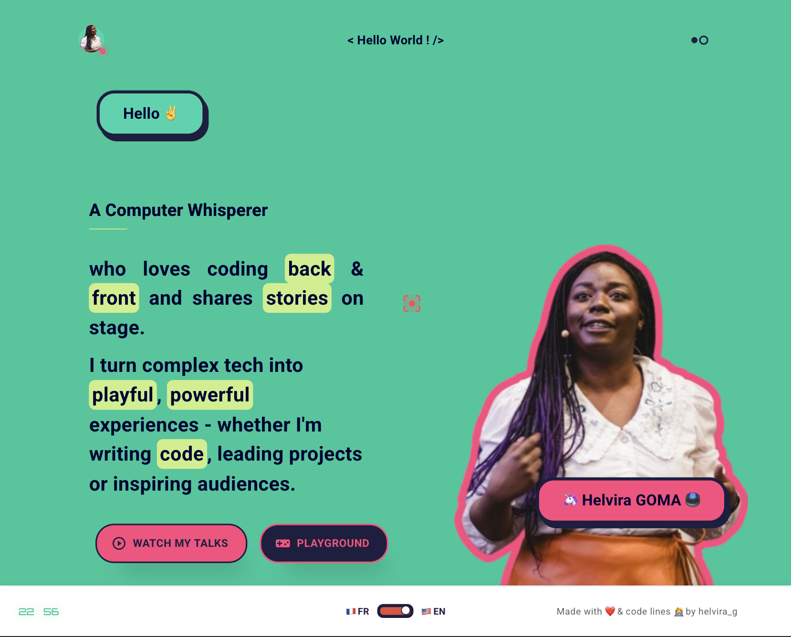

<!-- RESOURCES COVER -->

  

  

    Here is my website repository
     
     
    <a href="https://helvirag.github.io" style="padding: 6px 12px; color: black" onmouseover="this.style.color='purple'; this.style.fontWeight=''" onmouseleave="this.style.color='black'">🌐 Website</a>
    ·
    <a href="https://linkedin.com/helvira-dev" style="padding: 6px 12px; color: black" onmouseover="this.style.color='purple';fontSize=''" onmouseleave="this.style.color='black'; this.style.fontWeight='normal'; fontSize='12px'"> Linkedin</a>
    ·
    <a href="https://twitter.com/helvira_g" style="padding: 6px 12px; color: black" onmouseover="this.style.color='purple';" onmouseleave="this.style.color='black'">Twitter/X</a>
    ·
    <a href="https://bsky.app/profile/helvira.bsky.social" style="padding: 6px 12px; color: black" onmouseover="this.style.color='purple';" onmouseleave="this.style.color='black'">Bluesky</a>
    ·
    <a href="https://www.buymeacoffee.com/helvira" style="padding: 6px 12px; color: black" onmouseover="this.style.color='purple';" onmouseleave="this.style.color='black'">🥤 Buy me a coffee</a>
  

   
   
   

  

       <a href="https://helvira.dev" style="padding: 6px 12px; color: black" onmouseover="this.style.color='purple';" onmouseleave="this.style.color='black'">​🖥️ See the live website</a>
  

